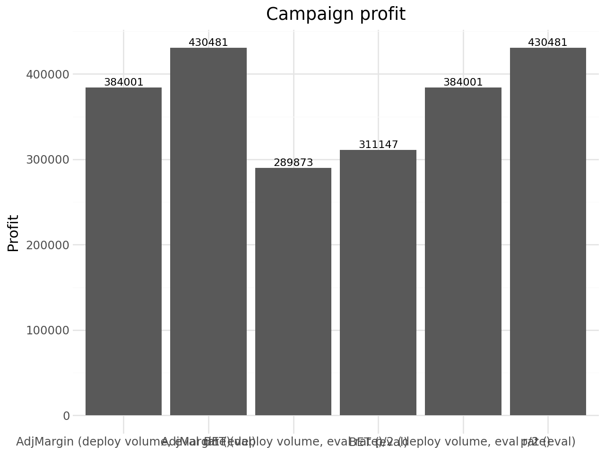

# Upgrade Targeting for QuickBooks Direct Marketing — Intuit

**Tools:** Python · Polars · pyrsm · scikit-learn · XGBoost · Plotnine  
**Models:** Logistic Regression · Logistic Regression with Interactions · Neural Network (MLP) · Random Forest · XGBoost  
**Techniques:** Response Modeling · Cross-Validation · Profit Optimization · Mailing Policy Design · ROME Analysis

Solo-led MSBA team project focused on predicting upgrade response to a QuickBooks direct-mail campaign and converting model scores into a profitable wave-2 mailing strategy.

## At a Glance

- Built and compared five response-modeling approaches for an upsell mailing campaign
- Improved holdout AUC from about **0.768** with the baseline MLP/logistic tier to **0.788** with tuned XGBoost
- Evaluated both break-even and half-threshold mailing rules on the holdout set
- Best policy: **`mail_xgb_50thr`**, mailing about **27.8%** of customers
- Estimated wave-2 profit of about **449.5K** with **ROME 1.50**



The final comparison shows that model-based targeting, especially the tuned XGBoost half-threshold rule, generates the highest expected campaign profit.

---

## Business Problem

Intuit wants to optimize a second-wave direct-mail campaign encouraging small-business customers to upgrade QuickBooks. The task is not just to predict who is likely to respond, but to decide **who should actually receive the mailing** once mailing cost and expected revenue are considered together.

This project treats campaign targeting as a business decision problem: score customers, apply mailing rules tied to expected value, and compare the resulting profit and return on marketing expense.

---

## Approach

### Predictive Modeling

The project uses a train/test split to compare:

| Model | Role |
|---|---|
| Logistic Regression | Baseline interpretable model |
| Logistic Regression with Interactions | Feature-engineered extension |
| Neural Network (MLP) | Flexible nonlinear benchmark |
| Random Forest | Tree-based benchmark |
| XGBoost | Best-performing tuned model |

Hyperparameter tuning uses **5-fold Stratified K-Fold cross-validation** with AUC as the primary selection metric.

### Mailing Policy Design

After scoring the test set, the notebook evaluates two deployment styles:

1. **Break-even threshold (`p_be`)**: mail when expected response probability clears the mailing-cost break-even point
2. **Half-threshold (`0.5 * p_be`)**: a more aggressive but still value-aware policy

Each rule is translated into:

- share mailed
- expected buyers
- mailing spend
- expected profit
- **ROME** (return on marketing expense)

---

## Key Results

> Campaign economics are evaluated on the holdout sample and scaled to wave-2 deployment volume.

### Model Performance

| Model | Holdout AUC |
|---|---:|
| Baseline MLP / logistic tier | 0.768 |
| Logistic with interactions | 0.784 |
| Tuned MLP | 0.777 |
| Tuned Random Forest | 0.728 |
| Tuned XGBoost | **0.788** |

### Best Mailing Policies by Profit

| Rule | Share Mailed | Expected Profit | ROME |
|---|---:|---:|---:|
| `mail_xgb_50thr` | 27.8% | **449.5K** | 1.50 |
| `mail_clf_50thr` | 28.8% | 446.2K | 1.44 |
| `mail_mlpcv_50thr` | 28.8% | 444.4K | 1.43 |
| `mail_clf_int_50thr` | 26.6% | 438.6K | **1.53** |
| `mail_rf_50thr` | 28.6% | 364.0K | 1.18 |

### Benchmark Heuristics

The notebook also evaluates simpler heuristic rules such as BET and adjusted-margin targeting. Those benchmark strategies produced profit around **430.5K**, below the best model-based policy.

### Business Recommendation

Use the tuned XGBoost model with the half-threshold mailing rule (`mail_xgb_50thr`) for wave 2. It provides the highest estimated total profit while mailing a minority of the file, showing that selective targeting beats broader response chasing.

---

## Deliverables

- [intuit-redux.ipynb](./intuit-redux.ipynb): end-to-end notebook with model comparison, threshold rules, and scaled campaign economics
- `data/`: QuickBooks upgrade response dataset and field descriptions
- `assets/`: exported profit comparison visual used in the README
- [requirements.txt](./requirements.txt): Python dependencies for reproduction

---

## Project Structure

```text
├── intuit-redux.ipynb
├── assets/
│   └── intuit-profit-comparison.png
├── data/
│   ├── intuit75k.parquet
│   └── intuit75k_description.md
├── requirements.txt
├── .gitignore
└── LICENSE
```

---

## Setup

```bash
pip install -r requirements.txt
```

Then run `intuit-redux.ipynb` top to bottom.

## Data Note

This repo uses an Intuit QuickBooks direct-marketing case dataset provided for academic analysis. The data represents wave-1 campaign outcomes and is used here to design a more profitable wave-2 targeting policy.

## Interpretation Note

The projected profits in this repo are **decision-model estimates**, not realized field results. They should be interpreted as campaign-planning guidance under the notebook’s stated margin, mailing-cost, and response-rate assumptions.

---

## Skills Demonstrated

- Direct-marketing response modeling
- Cross-validated model comparison
- Threshold-based campaign targeting
- Expected-profit and ROME analysis
- Translating model scores into deployable mailing rules
- Business recommendation writing from test-set economics
